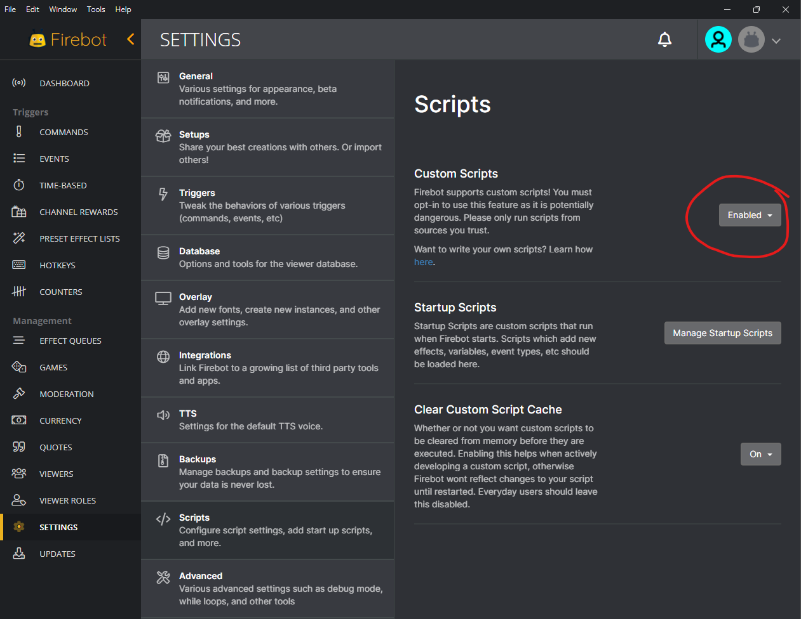
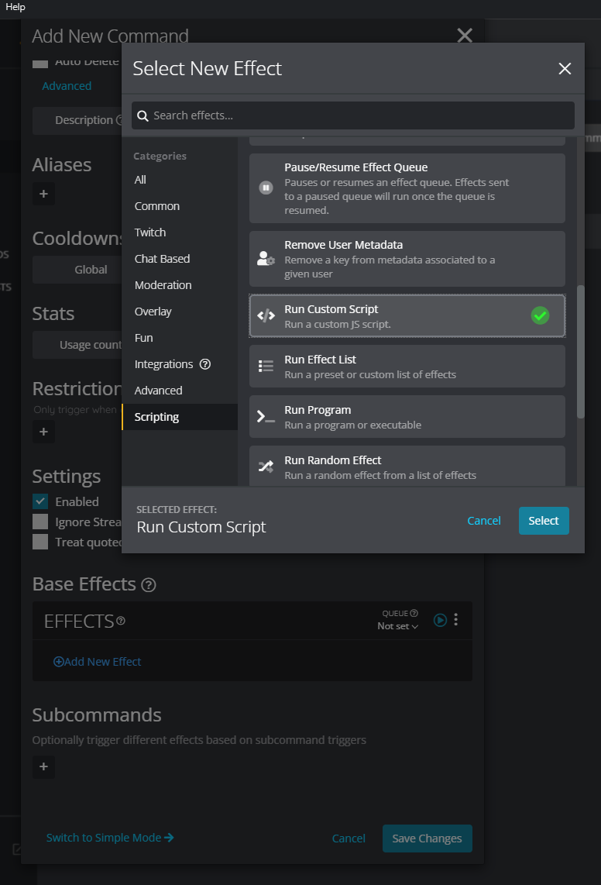
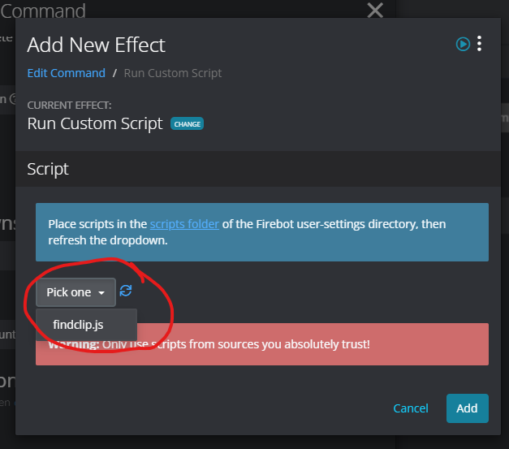

# FindClip custom script for Firebot

## What is it?

This is a custom script for [Firebot](https://firebot.app/) which can be used to create a `!findclip` command which will find a clip by searching on the title.

E.g. entering the command:

`!findclip hi there`

might find a clip titled "OH, hi there, weirdo!"

If a clip is found, then the link is posted in chat.

The command will only search clips for the broadcaster's channel.

## Download

[findclip.js](https://github.com/spacemonkeyJT/FindClip/releases/latest/download/findclip.js)

## How to install

In Firebot, click **SETTINGS** on the side bar, then **Scripts**, and enable **Custom Scripts** if it's not already enabled.

Add a new command and enter "!findclip" for the trigger, then add the **Run Custom Script** effect.

Edit the effect, and click **scripts folder** to open the scripts folder.

Download the [findclip.js](https://github.com/spacemonkeyJT/FindClip/releases/latest/download/findclip.js) file and save it into the scripts folder.

Click the refresh button and choose the **findclip.js** file.

Click **Add** and save the command. Edit any other settings as needed, then it should be good to go.
